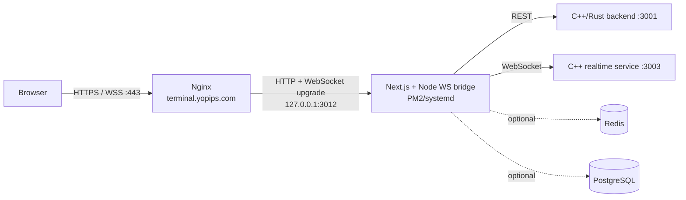
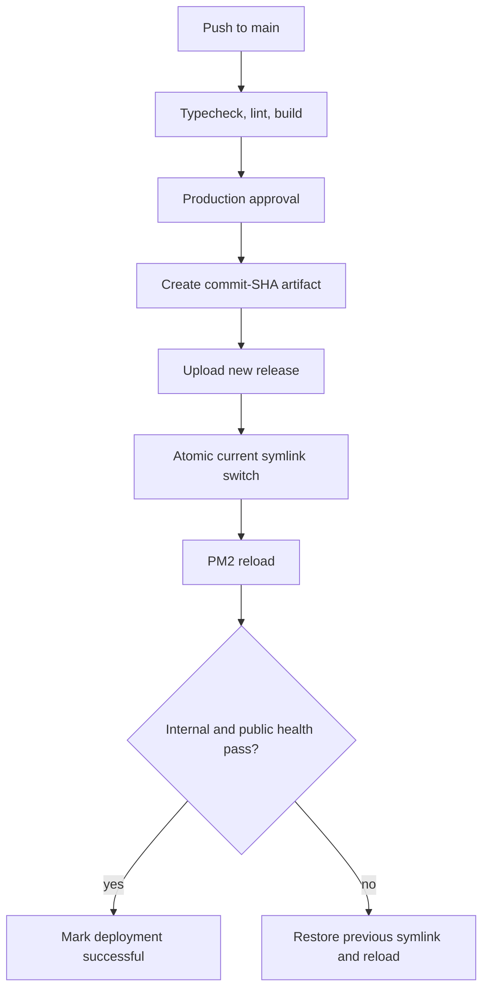

# YoPips Terminal Production Deployment Plan

## 1. Deployment target

| Item | Production value |
| --- | --- |
| Application | `yopips-terminal` (Next.js 14 plus custom Node WebSocket bridge) |
| Public URL | `https://terminal.yopips.com` |
| DNS record | `terminal.yopips.com` `A` record -> `37.187.159.136` |
| Initial SSH access | `root@37.187.159.136` |
| Application user | `yopips-terminal` (non-root, created during bootstrap) |
| Application port | `127.0.0.1:3012` (`3002` is already used by the reseller app) |
| Edge proxy | Nginx on ports 80 and 443 |
| TLS | Let's Encrypt certificate with automatic renewal |
| Repository | `YoForex005/YP_NEW_Terminal` |
| Production branch | `main` |
| Runtime | Node.js 24 LTS, npm, PM2 managed by systemd |
| Release directory | `/opt/yopips-terminal` |

The production target is an Ubuntu server at `37.187.159.136`.

## 2. Production topology



Only Nginx ports 80/443 are public. Port 3012 binds to loopback. Backend,
realtime, Redis, PostgreSQL, and MT5 access should use private networking or
strict source-IP firewall rules; they must not be opened globally.

## 3. Required information before deployment

Deployment cannot begin until these values are confirmed:

1. Exact Ubuntu version (the commands below support Ubuntu 22.04 or 24.04).
3. Backend REST origin for `TERMINAL_API_BASE` (bare origin, without `/api`).
4. Browser-accessible terminal WebSocket origin for
   `NEXT_PUBLIC_TERMINAL_WS_BASE`.
5. C++ realtime WebSocket origin for `CPP_REALTIME_WS_URL`.
6. Whether the backend is on this server, a private server, or a public domain.
7. Whether PostgreSQL and Redis are required by the enabled terminal routes.
7. DNS-provider access to create the `terminal.yopips.com` record.

## 4. Safety decisions for the first release

- Keep `NEXT_PUBLIC_TERMINAL_TRADE_DRY_RUN=true`.
- Keep `NEXT_PUBLIC_ENABLE_REAL_TRADING=false`.
- Keep `DEV_AUTO_AUTH=false` and `DEV_AUTO_PROVISION_USERS=false`.
- Generate a unique `WEBTRADER_TOKEN_SECRET` with at least 32 random bytes.
- Do not put `.env.production`, SSH private keys, database credentials, or MT5
  credentials in Git.
- Use `root` only for one-time server bootstrap. CI/CD logs in as the restricted
  `deploy` user afterward.
- Enable real trading only in a separate approved release after login, account
  isolation, quote streaming, order validation, and rollback tests pass.

`NEXT_PUBLIC_*` variables are embedded into the browser bundle during
`npm run build`. CI must therefore provide the production public variables at
build time; changing them only on the server after building will not update the
browser bundle.

## 5. Server bootstrap (one time)

Run the bootstrap through the initial `root` SSH login:

1. Patch Ubuntu and install Nginx, Git, curl, UFW, fail2ban, and Certbot.
2. Install Node.js 24 LTS and PM2.
3. Create restricted users:
   - `yopips-terminal`: owns and runs the application.
   - `deploy`: SSH target used by GitHub Actions.
4. Create this release layout:

   ```text
   /opt/yopips-terminal/
   ├── current -> releases/<release-id>
   ├── releases/
   └── shared/
       └── .env.production
   ```

5. Give `yopips-terminal` ownership of the application directory. Allow
   `deploy` to run only the deployment script through passwordless sudo; do not
   grant unrestricted sudo.
6. Disable password SSH login after SSH-key access is proven. Disable direct
   root SSH login after the deploy user is proven.
7. Configure UFW to allow `OpenSSH`, `Nginx Full`, and nothing else publicly.
8. Configure PM2 startup under the `yopips-terminal` account and enable its
   generated systemd unit.

## 6. Production environment

Store `/opt/yopips-terminal/shared/.env.production` on the server with mode
`0600`. A starting template is:

```dotenv
NODE_ENV=production
HOST=127.0.0.1
PORT=3012

TERMINAL_API_BASE=<BACKEND_HTTP_ORIGIN>
RUST_GATEWAY_HTTP_URL=<BACKEND_HTTP_ORIGIN>
RUST_GATEWAY_PUBLIC_API_BASE_URL=<BACKEND_HTTP_ORIGIN>
NEXT_PUBLIC_API_BASE_URL=<BROWSER_ACCESSIBLE_BACKEND_ORIGIN>

NEXT_PUBLIC_TERMINAL_API_BASE=proxy
NEXT_PUBLIC_TERMINAL_WS_BASE=<BROWSER_ACCESSIBLE_WSS_ORIGIN>
NEXT_PUBLIC_TERMINAL_TRADE_DRY_RUN=true
NEXT_PUBLIC_ENABLE_REAL_TRADING=false

NEXT_PUBLIC_WS_URL=/ws
NEXT_PUBLIC_WS_MARKET_URL=/ws/market
NEXT_PUBLIC_WS_OHLC_URL=/ws/ohlc
NEXT_PUBLIC_WS_ACCOUNT_URL=/ws/account
NEXT_PUBLIC_WS_TRADE_URL=/ws/trade

CPP_REALTIME_WS_URL=<PRIVATE_CPP_REALTIME_WS_ORIGIN>
MT5_REALTIME_WS_URL=<PRIVATE_CPP_REALTIME_WS_ORIGIN>
NODE_WS_PATHS=/ws,/api/ws,/stream,/realtime,/
NODE_WS_AUTH_TIMEOUT_MS=10000
NODE_WS_MAX_PENDING_FRAMES=200
WEBTRADER_TOKEN_SECRET=<GENERATED_SECRET>
WEBTRADER_TOKEN_TTL_SECONDS=900

DEV_AUTO_AUTH=false
DEV_AUTO_PROVISION_USERS=false
NEXT_PUBLIC_DASHBOARD_DATA_SOURCE=api
NEXT_PUBLIC_ENABLE_SYNTHETIC_MARKET_DATA=false
NEXT_PUBLIC_ENABLE_LEGACY_QUOTES_SOCKET_IO=false
```

Add `DATABASE_URL`, `REDIS_URL`, MarketAux, and MT5 settings only when the
production architecture requires the corresponding server routes. Secrets stay
in the server environment or GitHub Environment secrets, never in the public
variables.

## 7. Process manager

The production process must execute the custom bridge entrypoint:

```text
node server.mjs --prod
```

Do not use plain `next start`, because it would omit the WebSocket bridge in
`server.mjs`. Add a PM2 ecosystem file in the implementation phase with:

- working directory `/opt/yopips-terminal/current`;
- script `server.mjs` and argument `--prod`;
- one forked instance initially (WebSocket connections are stateful);
- `NODE_ENV=production`, `HOST=127.0.0.1`, and `PORT=3012`;
- graceful shutdown and bounded restart policy;
- timestamped logs plus `pm2-logrotate`.

## 8. Nginx and TLS

Create an Nginx server block for `terminal.yopips.com` that:

- redirects HTTP to HTTPS after the certificate exists;
- proxies all HTTP traffic to `http://127.0.0.1:3012`;
- passes `Host`, `X-Real-IP`, `X-Forwarded-For`, and `X-Forwarded-Proto`;
- supports WebSocket upgrades (`Upgrade`, `Connection`, HTTP/1.1) on bridge and
  terminal socket paths;
- uses long proxy read/send timeouts for WebSocket connections;
- enables reasonable security headers without breaking Next.js assets;
- sets an upload/body limit appropriate to the application.

After DNS resolves to the server, issue the certificate:

```bash
certbot --nginx -d terminal.yopips.com
certbot renew --dry-run
```

Update the backend CORS and allowed-origin configuration to include exactly
`https://terminal.yopips.com`. Add `terminal.yopips.com` to Next.js Server
Actions `allowedOrigins` before the production build.

## 9. CI/CD design (GitHub Actions)

Use two workflows.

### Pull-request CI

Trigger on pull requests targeting `main`:

1. Checkout repository.
2. Install Node.js 24 with npm cache.
3. Run `npm ci`.
4. Run `npm run typecheck`.
5. Run `npm run lint`; warnings should be tracked and new warnings should not be
   introduced.
6. Run `npm run build` with non-secret production-shaped test values.
7. Block merge if any required check fails.

### Production deployment

Trigger on a push to `main`, with a GitHub `production` Environment approval
gate for the first releases:

1. Repeat install, typecheck, lint, and build checks.
2. Package only the required runtime files and build output into a versioned
   artifact identified by the commit SHA.
3. Verify the artifact checksum.
4. Upload it over SSH to a new
   `/opt/yopips-terminal/releases/<commit-sha>` directory.
5. Link the shared `.env.production` into the release.
6. Install production dependencies deterministically with `npm ci --omit=dev`
   if they are not included in the artifact.
7. Atomically move `current` to the new release.
8. Reload the PM2 process with environment refresh.
9. Poll `http://127.0.0.1:3012/api/node-bridge/health` on the server.
10. Poll `https://terminal.yopips.com/api/node-bridge/health` externally.
11. If either health check fails, point `current` back to the previous release
    and reload PM2 automatically.
12. Retain the latest five successful releases and delete older ones.

### GitHub Environment secrets and variables

Secrets:

- `PROD_SSH_HOST`
- `PROD_SSH_PORT` (normally `22`)
- `PROD_SSH_USER` (`deploy`, not `root`)
- `PROD_SSH_PRIVATE_KEY`
- `PROD_SSH_HOST_KEY` (pinned `known_hosts` entry)
- any secret build-time values, only if truly required during build

Environment variables (non-secret):

- `PROD_APP_URL=https://terminal.yopips.com`
- production `NEXT_PUBLIC_*` values used by the build

Pin third-party GitHub Actions to immutable commit SHAs. Use GitHub OIDC or a
restricted deploy key where practical. Never disable SSH host-key checking.

## 10. Release and rollback flow



Rollback is deployment-only and must not run database migrations backward.
Database schema changes, if introduced later, require backward-compatible
expand/migrate/contract releases.

## 11. Production validation checklist

Before switching users to production:

- DNS resolves `terminal.yopips.com` to the supplied production IP.
- TLS is valid and HTTP redirects to HTTPS.
- `https://terminal.yopips.com` loads with no mixed-content errors.
- `/api/node-bridge/health` returns HTTP 200 internally and publicly.
- Login cookie has `Secure`, `HttpOnly`, and appropriate `SameSite` behavior.
- REST proxy calls reach the intended backend.
- WebSocket connections upgrade over `wss://` and remain connected.
- Account A cannot view or trade Account B data.
- Symbols, quotes, OHLC, balance, positions, and history use real data.
- A dry-run order is validated without creating an MT5 order.
- PM2 restarts the process after a controlled process termination.
- Rebooting the server restores Nginx and the PM2 application.
- Automated rollback is tested with a deliberately failed health check.
- Nginx, application, authentication, and deployment logs are reviewable.
- Backups and restore procedures exist for any local persistent data.

## 12. Implementation sequence

1. **Confirm infrastructure inputs**: server IP, Ubuntu version, backend/WS
   origins, DNS access, and data services.
2. **Fix production readiness**: add the production hostname to Server Actions,
   add the PM2 ecosystem, Nginx template, health semantics, and deployment
   scripts.
3. **Add CI**: dependency install, typecheck, lint, and production build for
   every pull request.
4. **Bootstrap server**: users, packages, firewall, directories, SSH hardening,
   PM2, Nginx, and server-held environment.
5. **Configure DNS/TLS**: point `terminal.yopips.com`, wait for propagation,
   then issue and test the certificate.
6. **Add CD**: GitHub production environment, pinned secrets, artifact-based
   deploy, health checks, and automatic rollback.
7. **Deploy with trading disabled**: validate the complete read-only and dry-run
   terminal flow.
8. **Go-live approval**: enable real trading only after a separate business and
   technical sign-off, then rebuild because the flag is public/build-time.

## 13. Current readiness baseline (10 July 2026)

The following checks were run locally from a clean `npm ci` install:

| Check | Result | Production implication |
| --- | --- | --- |
| `npm run typecheck` | Passed | Suitable as a required CI check. |
| `npm run lint` | Passed with existing warnings | CI can start as pass/fail now; resolve Hook and image warnings separately. |
| `npm run build` | Passed | The application compiles successfully. |
| `npm audit` summary from install | 14 findings: 5 moderate, 9 high | Review with `npm audit`; do not use `--force` blindly because it may introduce breaking upgrades. |
| Redis during build | Repeated connection failures to `127.0.0.1:6379`, build still passed | Remove eager Redis connection at build/import time or provide a CI Redis service before treating build logs as clean. Confirm production Redis topology. |

The build read an existing local `.env`; CI must use explicit controlled values
so a developer's local environment can never influence a production artifact.

The supplied `.env` currently targets `api.yopips.com`, but it also has real
trading enabled, trade dry-run disabled, and development auto-auth enabled. The
file will be reused as requested, but those three values require explicit
go-live approval before it is installed on the server. The recommended first
deployment values remain the safe settings in section 4.

## 14. Definition of done

The production deployment is complete only when:

- a merged commit deploys through GitHub Actions without manual server edits;
- the exact deployed commit is visible in the release directory/logs;
- health checks and WebSocket upgrades pass on the public domain;
- a failed deployment rolls back automatically;
- the application survives a server reboot;
- no secrets exist in Git history, build artifacts, browser JavaScript, or CI
  logs; and
- the dry-run production acceptance checklist is signed off before real trading
  is enabled.
